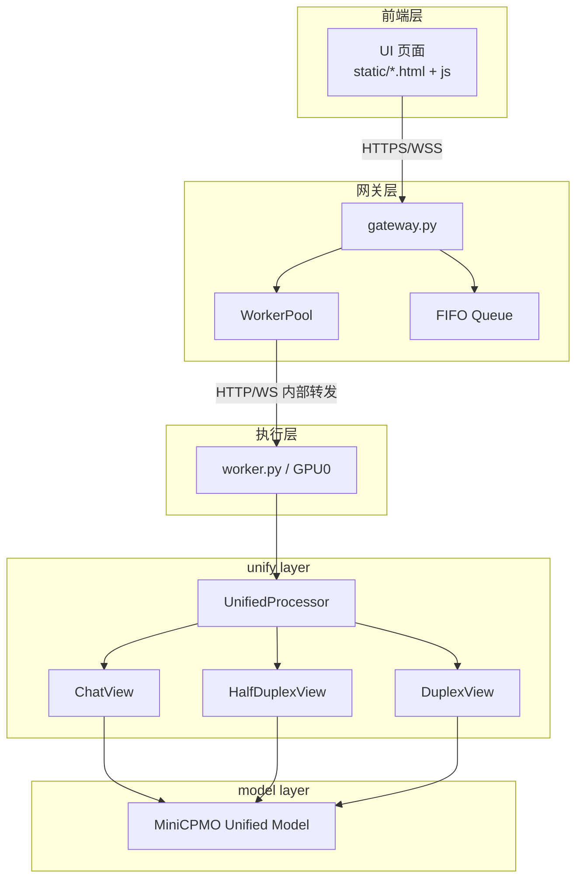
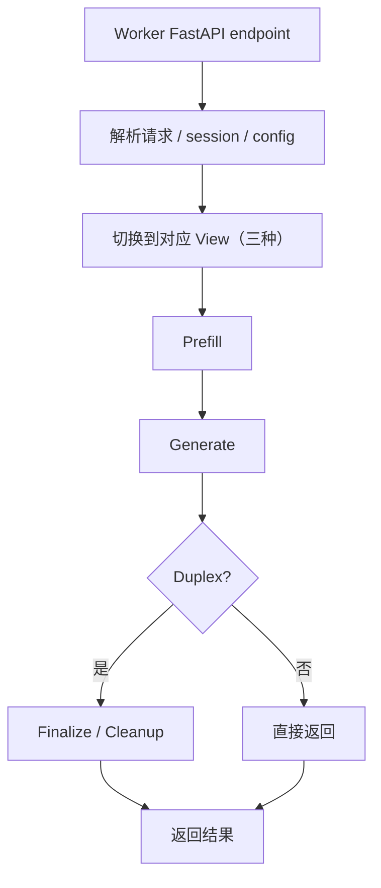
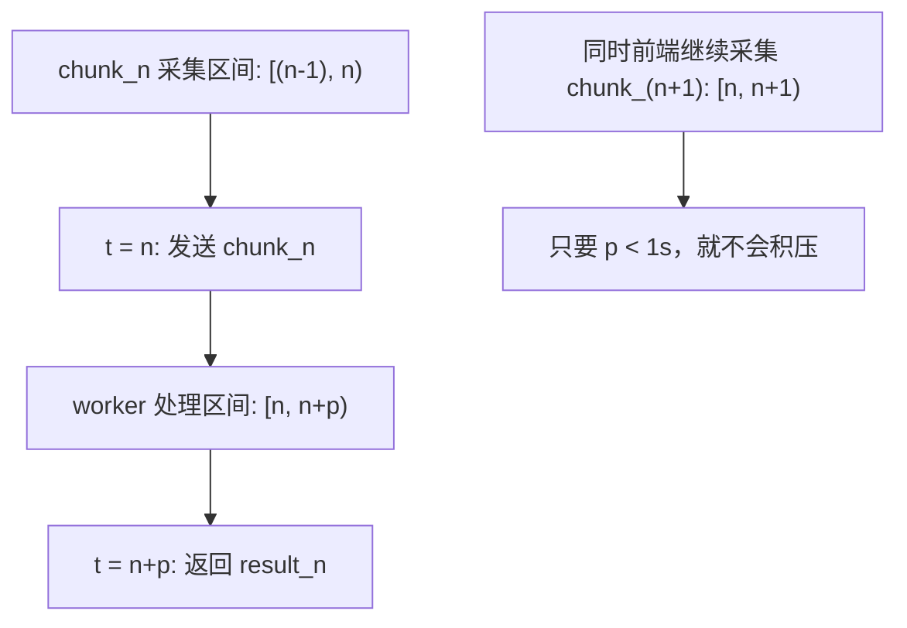

## 总体框架

```mermaid
graph TB
    subgraph FE [前端层]
        UI["UI 页面<br/>static/*.html + js"]
    end

    subgraph GW [网关层]
        Gateway["gateway.py"]
        Pool["WorkerPool"]
        Queue["FIFO Queue"]
    end

    subgraph WK [执行层]
        W0["worker.py / GPU0"]
    end

    subgraph VW [unify layer]
        UP["UnifiedProcessor"]
        CV["ChatView"]
        HV["HalfDuplexView"]
        DV["DuplexView"]
    end

    subgraph MD [model layer]
        M["MiniCPMO Unified Model"]
    end

    UI -->|"HTTPS/WSS"| Gateway
    Gateway --> Pool
    Gateway --> Queue
    Pool -->|"HTTP/WS 内部转发"| W0
    W0 --> UP
    UP --> CV
    UP --> HV
    UP --> DV
    CV --> M
    HV --> M
    DV --> M
```

## Worker 内部完整执行框架

`worker.py` 可以理解为“FastAPI 协议层 + UnifiedProcessor 调度层 + 生命周期管理层”。

```mermaid
flowchart TD
    A["Worker FastAPI endpoint"] --> B["解析请求 / session / config"]
    B --> C["切换到对应 View（三种）"]
    C --> D["Prefill"]
    D --> E["Generate"]
    E --> F{"Duplex?"}
    F -->|是| G["Finalize / Cleanup"]
    F -->|否| H["直接返回"]
    G --> I["返回结果"]
    H --> I
```

## Timeline 简图

```mermaid
  flowchart TD
      A["chunk_n 采集区间: [(n-1), n)"] --> B["t = n: 发送 chunk_n"]
      B --> C["worker 处理区间: [n, n+p)"]
      C --> D["t = n+p: 返回 result_n"]

      E["同时前端继续采集 chunk_(n+1): [n, n+1)"] --> F["只要 p < 1s，就不会积压"]
```

[duplex-flow detail](model_detail.md)