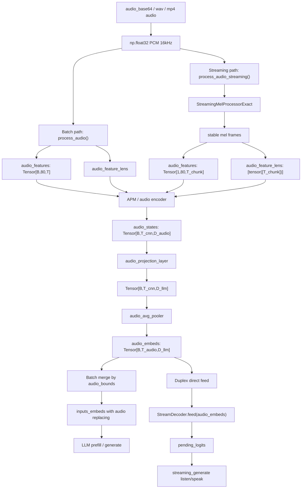

# Audio stage

MiniCPM-o 4.5 demo 中的 audio 输入最终会被转换成 LLM hidden size 对齐的
audio embedding。整体链路可以分为两类：

- Chat / half-duplex 的 batch audio path：一次性处理完整 audio，生成 placeholder，再把 audio embedding scatter 到文本 embedding 中。
- Duplex 的 streaming audio path：每个 unit 处理一段音频，直接把 audio embedding feed 到 `StreamDecoder` 的 KV cache 中。


## Stage A0: AudioChunkInput

```python
AudioChunkInput:
    audio_base64: str | None
    audio_waveform: np.ndarray
    sample_rate: int = 16000
    dtype: np.float32
    chunk_ms: int = 1000
```

```python
AudioChunkBatch:
    chunks: list[np.ndarray]
    source: "websocket" | "mp4" | "file"
```

[worker.py line:1600](../../../worker.py)

实时 duplex WebSocket 中，前端传入 `audio_base64`，worker 解码为
`np.float32` PCM：

```python
audio_bytes = base64.b64decode(msg["audio_base64"])
audio_waveform = np.frombuffer(audio_bytes, dtype=np.float32)
```

MP4 离线路径中，`_extract_mp4_chunks()` 通过 ffmpeg 提取 16kHz mono wav，
然后按 1 秒切分。

[_extract_mp4_chunks line:1082](../../../MiniCPMO45/modeling_minicpmo_unified.py)


## Stage A1: AudioPreprocess / MelFeature

```python
AudioPreprocessInput:
    audios: np.ndarray | list[np.ndarray]
    sampling_rate: int = 16000
    mode: "batch" | "streaming"
```

```python
AudioProcessorOutput:
    audio_features: torch.Tensor
    # [batch, 80, frames]
    audio_feature_lens: list[torch.Tensor]
    # per batch item, each tensor records valid frame lengths
```

把“原始音频波形（waveform）”的 np.ndarray 转成 Whisper 风格的 Mel 特征（torch.Tensor），再把长度信息一起打包返回。

### Batch path

[process_audio line:1169](../../../MiniCPMO45/processing_minicpmo.py)

`MiniCPMOProcessor.process_audio()` 调用 `process_audio_batch()`，底层使用
`MiniCPMAAudioProcessor` / Whisper feature extractor 生成 log-mel feature。

核心输出：

```python
audio_features: Tensor[batch, 80, max_frames]
audio_feature_lens: list[Tensor]
```

如果音频超过 30 秒，会按 30 秒切开再处理。

### Streaming path

[process_audio_streaming line:1209](../../../MiniCPMO45/processing_minicpmo.py)

Duplex 使用 `process_audio_streaming()`。它依赖
`StreamingMelProcessorExact`，处理方式是：

1. 把当前 audio chunk 追加到内部 buffer。
2. 基于当前 buffer 重新提取 mel。
3. 只输出已经稳定的 mel frames。
4. 通过 `audio_feature_lens` 记录本次实际输出的 frame 数。

返回：

```python
MiniCPMOBatchFeature:
    audio_features: Tensor[1, 80, n_frames]
    audio_feature_lens: [tensor([n_frames])]
    streaming_info: dict
```

Duplex 中第一段音频使用 `FIRST_CHUNK_MS = 1035`，后续使用
`CHUNK_MS = 1000`。如果第一段不足长度，会在左侧补零。

[streaming_prefill audio process line:4845](../../../MiniCPMO45/modeling_minicpmo_unified.py)


## Stage A2: AudioPlaceholder / AudioBound

```python
AudioPlaceholderInput:
    audio_lens: int
    chunk_input: bool
    chunk_length: int = 1
```

```python
AudioPlaceholderOutput:
    placeholder: str
    # <|audio_start|><unk>...<|audio_end|>
```

[get_audio_placeholder line:1025](../../../MiniCPMO45/processing_minicpmo.py)

在 Chat / half-duplex batch path 中，音频不是直接 feed 给 LLM，而是先在文本
prompt 中插入 audio placeholder。

placeholder 长度由音频长度推导：

```python
feature_lens = ceil(audio_lens / hop_length)
feature_lens = (feature_lens - 1) // 2 + 1
output_lens = (feature_lens - pool_step) // pool_step + 1
```

其中：

- Whisper encoder 的 CNN 下采样约为 `ceil(T / 2)`。
- `audio_pool_step = 5`，后续 avg pooling 再降低 token 数。
- 最终 `output_lens` 对应 audio embedding token 数。

文本 token 化后，`_convert()` 会记录：

```python
audio_bounds:
    Tensor[[audio_start + 1, audio_end], ...]
```

[_convert line:1498](../../../MiniCPMO45/processing_minicpmo.py)

也就是说 `<|audio_start|>` 和 `<|audio_end|>` 中间的 `<unk>` token
embedding 会被 audio embedding 替换。


## Stage A3: AudioEncode

```python
AudioEncodeInput:
    audio_features: Tensor[batch, 80, frames]
    audio_feature_lens: list[Tensor]
    stream_input: bool
    device
    dtype
```

```python
AudioEmbeddingOutput:
    embeddings: list[list[torch.Tensor]]
    # per batch item, per audio segment
    # each tensor shape roughly:
    #   [num_audio_tokens, hidden_size]
    hidden_size: int
    dtype: torch.dtype
    device: torch.device
```

Batch encoder:

[get_audio_embedding line:1619](../../../MiniCPMO45/modeling_minicpmo_unified.py)

Streaming encoder:

[get_audio_embedding_streaming line:1451](../../../MiniCPMO45/modeling_minicpmo_unified.py)

核心模型模块：

```text
audio_features
  -> self.apm                         # Whisper-style audio encoder
  -> self.audio_projection_layer       # project to LLM hidden size
  -> self.audio_avg_pooler             # AvgPool1d, step = audio_pool_step
  -> final_audio_embeds
```

shape 变化大致如下：

```text
audio_features:
    [B, 80, T_mel]

after apm:
    [B, T_cnn, audio_hidden]
    T_cnn = (T_mel - 1) // 2 + 1

after audio_projection_layer:
    [B, T_cnn, llm_hidden]

after audio_avg_pooler:
    [B, T_audio_token, llm_hidden]
    T_audio_token = (T_cnn - audio_pool_step) // audio_pool_step + 1
```

Streaming path 额外维护 `self.audio_past_key_values`，用于音频 encoder 的增量
cache。每次调用 `get_audio_embedding_streaming()` 都会：

1. 使用当前 mel frames 和历史 `audio_past_key_values` 做 APM forward。
2. 更新 `self.audio_past_key_values = audio_outputs.past_key_values`。
3. 根据 `audio_feature_lens` 裁剪出当前有效 audio token。

Duplex 中还会传入：

```python
use_extra_context = True
prefix_extra_frames = 0 if first chunk else 2
suffix_extra_frames = 2
```

用于给 CNN/encoder 边界提供额外上下文，并在 streaming encoder 内部修正实际输出长度。


## Stage A4: AudioEmbeddingMerge / FeedPlan

### Chat / half-duplex merge

[get_omni_embedding line:1708](../../../MiniCPMO45/modeling_minicpmo_unified.py)

普通多模态路径先生成文本 token embedding：

```python
vllm_embedding = self.llm.model.embed_tokens(input_ids)
```

然后 `get_omni_embedding()` 根据 `audio_bounds` 把 audio embedding 写入
placeholder 的位置：

```python
input_embeddings[i, audio_indices] = audio_embs
```

这条路径可以理解为：

```text
text embedding with <unk> placeholders
    + audio embedding
    -> final inputs_embeds
    -> LLM prefill / generate
```

### Duplex streaming feed

[streaming_prefill audio feed line:4883](../../../MiniCPMO45/modeling_minicpmo_unified.py)

Duplex 不通过文本 placeholder merge，而是在每个 unit 内直接 feed 到
`StreamDecoder`：

```python
embeds_nested = self.model.get_audio_embedding_streaming(...)
audio_embeds = torch.cat([t for g in embeds_nested for t in g], dim=0)
self.pending_logits, _ = self.decoder.feed(audio_embeds, return_logits=True)
```

因此 duplex audio 的实际 LLM 输入顺序是：

```text
<unit>
optional vision tokens / vision embeddings
audio_embedding_tokens
```

如果当前 unit 是 AUDIO 或 OMNI，audio embedding feed 完后会产生
`pending_logits`，后续 `streaming_generate()` 就基于这个 logits 决定
listen / speak。


## Audio data stream




## Backend boundary

从后端替换角度看，audio 可以拆成三个边界：

```python
AudioPreprocessBackend:
    np.ndarray -> audio_features, audio_feature_lens

AudioEncoderBackend:
    audio_features, audio_feature_lens -> list[list[Tensor[num_tokens, hidden]]]

AudioFeedBackend:
    audio_embeds -> LLM cache / pending_logits
```

当前 demo 的实现是原生 PyTorch：

- mel feature：`MiniCPMAAudioProcessor` / `StreamingMelProcessorExact`
- audio encoder：`self.apm`
- projection：`self.audio_projection_layer`
- pooling：`self.audio_avg_pooler`
- LLM feed：`StreamDecoder.feed()` 或 `get_omni_embedding()` scatter

