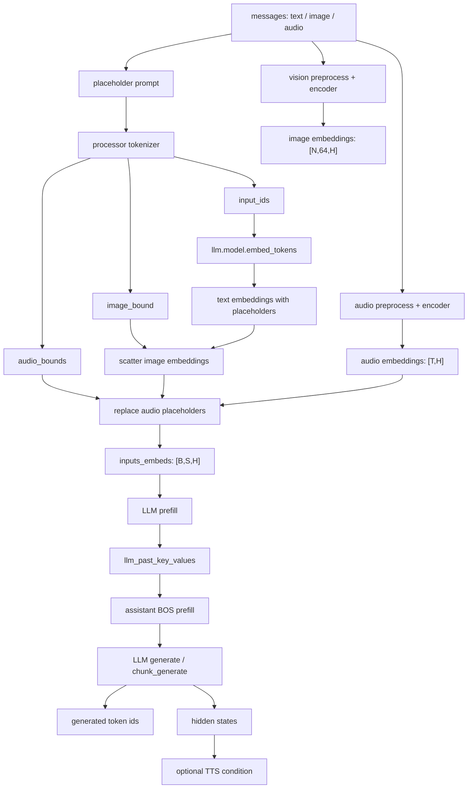
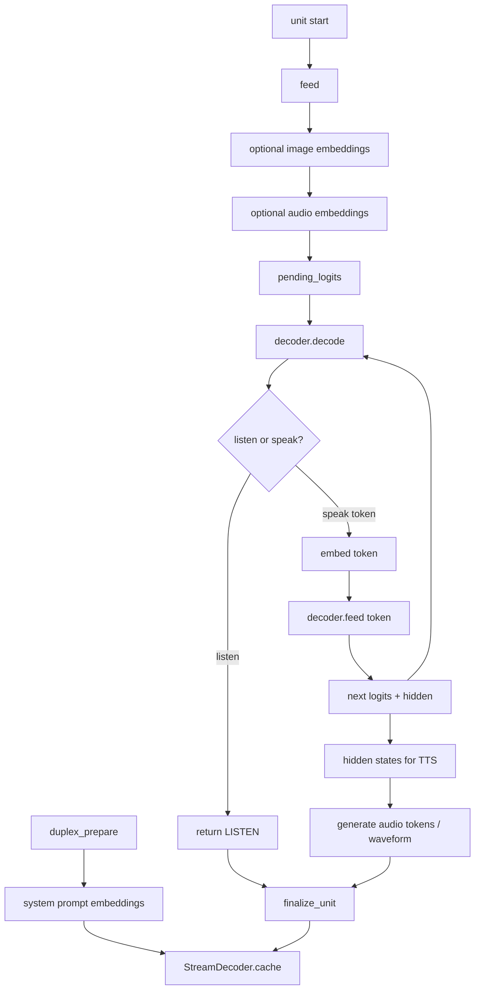

# Embedding and LLM stage

MiniCPM-o 4.5 demo 中，文本、图像、音频最终都会被对齐成同一个
LLM hidden size 的连续向量序列：

```python
inputs_embeds: torch.Tensor
# [batch, seq_len, llm_hidden_size]
```

LLM 并不直接理解 PIL image 或 waveform。多模态输入的核心是：

```text
text -> tokenizer -> input_ids -> text embeddings
image -> vision encoder -> image embeddings
audio -> audio encoder -> audio embeddings

text embeddings 中的 image/audio placeholder 区域被替换成真实多模态 embeddings
或在 duplex 中被手动 feed 到 LLM KV cache。
```


## Stage E0: Message to Placeholder Prompt

```python
EmbeddingPromptInput:
    messages: list[dict]
    content: str | PIL.Image.Image | np.ndarray
    mode: "chat" | "half_duplex" | "duplex"
```

```python
PlaceholderPromptOutput:
    prompt: str
    images: list[PIL.Image.Image]
    audios: list[np.ndarray]
```

[non_streaming_prefill line:3045](../../../MiniCPMO45/modeling_minicpmo_unified.py)

Chat / half-duplex 路径会把 message content 中的模态对象转换成占位符：

```python
Image.Image -> "<image>./</image>"
np.ndarray   -> "<audio>./</audio>"
str          -> 原始文本
```

然后通过 `tokenizer.apply_chat_template()` 生成 prompt。这里的
`<image>./</image>` 和 `<audio>./</audio>` 还不是最终 token 序列，只是给
processor 后续替换成模型需要的 `<unk>` placeholder。

Duplex 路径不完全依赖这种 prompt merge。它的系统 prompt 会先被 prefill，
后续每秒 unit 中的 image/audio embedding 会通过 `StreamDecoder.feed()`
直接进入 LLM KV cache。


## Stage E1: Tokenize and Bound Extraction

```python
TokenizeInput:
    prompt: str
    images: list[PIL.Image.Image]
    audios: list[np.ndarray]
```

```python
TokenizeOutput:
    input_ids: torch.Tensor
    image_bound: list[torch.Tensor]
    audio_bounds: list[torch.Tensor]
    pixel_values
    tgt_sizes
    audio_features
    audio_feature_lens
```

[MiniCPMOProcessor.__call__ output line:1536](../../../MiniCPMO45/processing_minicpmo.py)

processor 会先处理 image/audio，生成对应 placeholder：

- image placeholder：`<image>` + 64 个 `<unk>` + `</image>`，slice 也是同样逻辑。
- audio placeholder：`<|audio_start|>` + N 个 `<unk>` + `<|audio_end|>`。

之后 `_convert()` 记录 placeholder 在 token 序列中的范围：

[_convert line:1498](../../../MiniCPMO45/processing_minicpmo.py)

```python
image_bounds:
    [[image_start + 1, image_end], ...]

audio_bounds:
    [[audio_start + 1, audio_end], ...]
```

这些 bound 指向的就是需要被真实 embedding 替换的 `<unk>` 区域。


## Stage E2: Text Embedding Lookup

```python
TextEmbeddingInput:
    input_ids: torch.Tensor
    # [batch, seq_len]
```

```python
TextEmbeddingOutput:
    input_embeddings: torch.Tensor
    # [batch, seq_len, llm_hidden_size]
```

[get_vllm_embedding line:1418](../../../MiniCPMO45/modeling_minicpmo_unified.py)

文本 embedding 通过 LLM 自己的 embedding table 得到：

```python
vllm_embedding = self.llm.model.embed_tokens(data["input_ids"])
```

如果 LLM config 里有 `scale_emb`，会额外乘上 scale：

```python
vllm_embedding = self.llm.model.embed_tokens(input_ids) * self.llm.config.scale_emb
```

这一步得到的 `vllm_embedding` 仍然包含 placeholder 区域的普通 `<unk>`
embedding，后续会被 image/audio embedding 替换。


## Stage E3: Image Embedding Injection

```python
ImageEmbeddingInput:
    pixel_values
    tgt_sizes
    image_bound
    input_embeddings
```

```python
ImageEmbeddingOutput:
    input_embeddings_with_image
    vision_hidden_states:
        list[Tensor[num_slices, 64, llm_hidden_size]]
```

[get_vllm_embedding line:1418](../../../MiniCPMO45/modeling_minicpmo_unified.py)

`get_vllm_embedding()` 会先调用 `get_vision_embedding()`：

```python
vision_hidden_states = self.get_vision_embedding(data)
```

`get_vision_embedding()` 内部执行：

```text
pixel_values / tgt_sizes
  -> self.vpm
  -> self.resampler
  -> Tensor[num_image_or_slice, 64, llm_hidden_size]
```

然后按 `image_bound` 把文本 placeholder 替换掉：

```python
image_indices = torch.stack([
    torch.arange(r[0], r[1]) for r in cur_image_bound
])

cur_vllm_emb.scatter_(
    0,
    image_indices.view(-1, 1).repeat(1, hidden),
    cur_vs_hs.view(-1, hidden),
)
```

关键约束：

```text
image placeholder token 数 == image embedding token 数
每个 source image / slice 固定 64 tokens
```


## Stage E4: Audio Embedding Injection

```python
AudioEmbeddingInput:
    audio_features: Tensor[batch, 80, frames]
    audio_feature_lens
    audio_bounds
    input_embeddings
```

```python
AudioEmbeddingOutput:
    input_embeddings_with_audio
    audio_embeddings:
        list[list[Tensor[num_audio_tokens, llm_hidden_size]]]
```

[get_omni_embedding line:1699](../../../MiniCPMO45/modeling_minicpmo_unified.py)

`get_omni_embedding()` 负责把 audio embedding 合入 text/image embedding：

```python
if stream_input:
    audio_embeddings = self.get_audio_embedding_streaming(data)
else:
    audio_embeddings = self.get_audio_embedding(data, chunk_length)
```

audio encoder 输出：

```text
audio_features
  -> self.apm
  -> self.audio_projection_layer
  -> self.audio_avg_pooler
  -> Tensor[num_audio_tokens, llm_hidden_size]
```

然后根据 `audio_bounds` 替换 placeholder：

```python
input_embeddings[i, audio_indices] = embs.to(input_embeddings.dtype)
```

这里有严格 shape 检查：

```python
embs.shape[0] == len(audio_indices)
```

如果 placeholder token 数和 audio embedding token 数不一致，会直接报错。


## Stage E5: LLM Prefill

```python
LLMPrefillInput:
    inputs_embeds: Tensor[batch, seq_len, hidden]
    past_key_values: Optional[DynamicCache]
    attention_mask: Tensor
```

```python
LLMPrefillOutput:
    logits
    past_key_values
```

### Non-streaming prefill

[non_streaming_prefill line:3045](../../../MiniCPMO45/modeling_minicpmo_unified.py)

完整 message 一次性构造 `inputs_embeds` 后，送入 LLM：

```python
outputs = self.llm(
    past_key_values=self.llm_past_key_values,
    inputs_embeds=inputs_embeds,
    attention_mask=attention_mask,
    position_ids=None,
    use_cache=True,
    return_dict=True,
)

self.llm_past_key_values = as_dynamic_cache(outputs["past_key_values"])
```

这一步只做 prefill，不加 assistant generation prompt，不直接生成 token。
它的核心作用是把当前用户输入写入 LLM KV cache。

### Half-duplex streaming prefill

[streaming_prefill line:3409](../../../MiniCPMO45/modeling_minicpmo_unified.py)

Half-duplex 每次只处理一条 message 或一个音频 segment，但仍走：

```text
processor -> get_vllm_embedding -> get_omni_embedding -> self.llm(...)
```

区别在于它会维护跨 chunk 的 `self.llm_past_key_values`，并根据会话状态决定
prompt 前缀：

```text
first user chunk: "<|im_start|>user\n..."
next user turn:   "<|im_end|>\n<|im_start|>user\n..."
same turn chunk:  only current content
```


## Stage E6: LLM Decode / Generate

```python
LLMDecodeInput:
    llm_past_key_values
    bos_input / assistant prefix
    sampling_config
```

```python
LLMDecodeOutput:
    generated_ids
    generated_text
    updated_past_key_values
    hidden_states  # needed by TTS path
```

### Non-streaming generate

[non_streaming_generate line:3225](../../../MiniCPMO45/modeling_minicpmo_unified.py)

先构造 assistant BOS：

```python
bos_input = "<|im_end|>\n<|im_start|>assistant\n" + think_str + "<|tts_bos|>"
bos_embeds = self.llm.get_input_embeddings()(bos_input_ids)
```

然后把 BOS 注入 KV cache：

```python
bos_outputs = self.llm(
    past_key_values=self.llm_past_key_values,
    inputs_embeds=bos_embeds,
    use_cache=True,
    return_dict=True,
)
```

最后调用 HF `generate()`：

```python
outputs = self.llm.generate(
    input_ids=next_token,
    past_key_values=self.llm_past_key_values,
    output_hidden_states=True,
    return_dict_in_generate=True,
)
```

`output_hidden_states=True` 很重要，因为 TTS 需要 LLM hidden states。

### Half-duplex streaming generate

[streaming_generate line:3595](../../../MiniCPMO45/modeling_minicpmo_unified.py)

半双工不是直接一次 `generate()` 完所有内容，而是使用
`ChunkPrefillChunkGenerate`，每次生成一小段 token：

```python
output = llm_streaming_generator.chunk_generate(
    inputs_embeds=generation_inputs_embeds,
    past_key_values=self.llm_past_key_values,
    return_hidden_states=True,
    chunk_size=generate_chunk_size,
)
```

每个 chunk 更新：

```python
generated_ids = torch.cat([generated_ids, output.chunk_token_ids], dim=1)
generation_inputs_embeds = output.current_inputs_embeds
self.llm_past_key_values = output.past_key_values
```

如果启用 TTS，会把 token embedding 和 LLM hidden states 合成 TTS condition：

```python
llm_embeds = self.tts.emb_text(yield_chunk_token_ids)
hidden_embeds = self.tts.projector_semantic(output.last_hidden_states)
tts_embeds = llm_embeds + hidden_embeds
```


## Stage E7: Duplex Direct Feed Path

Duplex 与 Chat / half-duplex 最大区别是：它不总是构造完整的
`inputs_embeds` 后一次性 prefill，而是手动把 unit 内的 token embedding、
image embedding、audio embedding 依次 feed 到 `StreamDecoder`。

### StreamDecoder feed

[StreamDecoder.feed line:2061](../../../MiniCPMO45/utils.py)

```python
def feed(self, embeds, return_logits=False):
    past_len = self.get_cache_length()
    pos_ids = torch.arange(past_len, past_len + L).unsqueeze(0)

    out = self.m(
        inputs_embeds=embeds.unsqueeze(0),
        position_ids=pos_ids,
        past_key_values=self.cache,
        return_dict=True,
        output_hidden_states=True,
    )
    self.cache = out.past_key_values
```

如果 `return_logits=True`：

```python
logits = self.m.lm_head(out.hidden_states[-1])[:, -1]
return logits, out.hidden_states[-1]
```

这就是 duplex 中 `pending_logits` 的来源。

### Duplex prefill order

[Duplex streaming_prefill line:4543](../../../MiniCPMO45/modeling_minicpmo_unified.py)

每个 unit 的输入顺序：

```text
<unit>
optional:
    <image> image_embed[64] </image>
    <slice> slice_embed[64] </slice>
audio_embed[num_audio_tokens]
```

当有 audio 时：

```python
self.pending_logits, _ = self.decoder.feed(audio_embeds, return_logits=True)
```

当只有 vision 时，最后一个 vision token 会产生 `pending_logits`。

### Duplex generate

[Duplex streaming_generate line:4958](../../../MiniCPMO45/modeling_minicpmo_unified.py)

`streaming_generate()` 从 prefill 阶段保存的 `pending_logits` 开始：

```python
logits = self.pending_logits
self.pending_logits = None
```

然后手动 decode token：

```python
last_id = self.decoder.decode(logits=logits, ...)
```

如果生成的是普通 speak token，则继续 feed 回 LLM：

```python
logits, hidden = self.decoder.feed(
    self.decoder.embed_token(last_id.item()),
    return_logits=True,
)
```

也就是说 duplex decode 是一个显式循环：

```text
logits -> sample token -> embed token -> feed -> next logits
```

并且它会维护 listen/speak 状态、chunk terminator、turn terminator、
force listen、TTS hidden states 等业务逻辑。


## LLM Data Stream




## Duplex Data Stream




## Backend Boundary

从后端替换角度，embedding 到 LLM 可以拆成这些边界：

```python
TextEmbeddingBackend:
    input_ids -> text_embeddings

VisionEmbeddingBackend:
    pixel_values, tgt_sizes -> image_embeddings

AudioEmbeddingBackend:
    audio_features, audio_feature_lens -> audio_embeddings

EmbeddingMergeBackend:
    text_embeddings, image_bounds, audio_bounds, multimodal_embeddings -> inputs_embeds

LLMBackend:
    prefill(inputs_embeds, past_key_values) -> logits, past_key_values, hidden_states
    decode_step(logits, sampling_config) -> next_token
    embed_tokens(token_ids) -> token_embeddings
```

当前 demo 里这些边界还没有真正抽象成接口：

- text embedding 直接调用 `self.llm.model.embed_tokens`
- image/audio merge 在 `get_vllm_embedding()` / `get_omni_embedding()` 内完成
- non-streaming / half-duplex 使用 `self.llm(...)` 和 HF `generate()`
- duplex 使用 `StreamDecoder.feed()` 手动维护 KV cache

如果后续要适配 vLLM、TensorRT-LLM 或自定义算子，最关键的兼容点是：

1. 支持 `inputs_embeds` prefill。
2. 支持返回或维护 KV cache。
3. 支持逐 token decode step。
4. 支持返回 hidden states，至少 TTS 所需 token 对应的 hidden states。
5. 支持特殊 token 采样逻辑，尤其是 duplex 的 listen/speak/chunk/turn 状态机。
