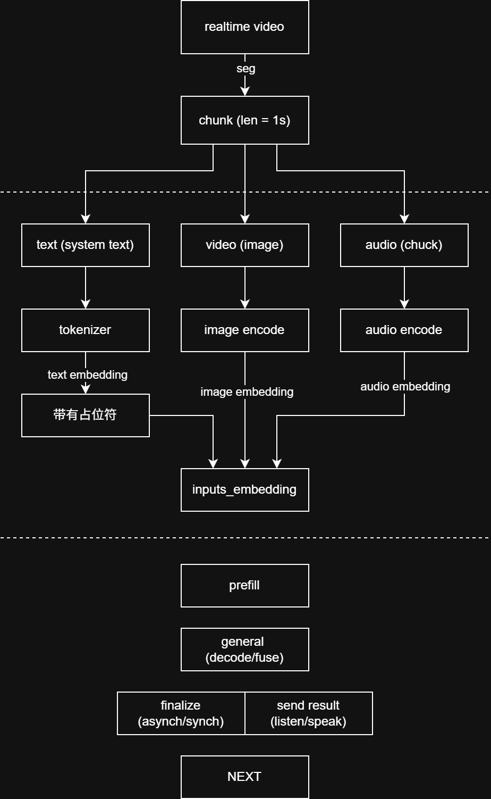
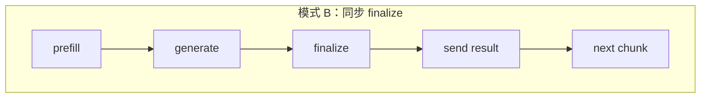
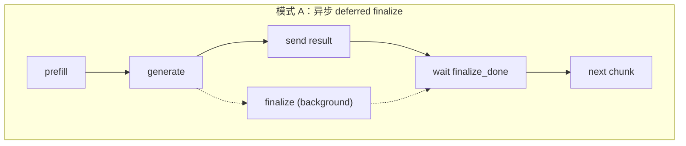

# 双工多模态

## 1 传统LLM & duplex 多模态



### 1.1 传统LLM

文本 

→ tokenizer （将文本切分出离散编号）

→ inputs_ids 

→ embedding table lookup

→ inputs_embeds （已经查好或构造好的连续向量）

→ Transformer

### 1.2 duplex 多模态

文本 prompt
→ tokenizer 得到 input_idsM["MiniCPMO Unified Model"]

→ 找到 <image>...</image> 或 <audio>...</audio> 的位置

→ 文本 token 先查 embedding table

→ 图片送入 vision encoder，得到 image embeddings

→ 音频送入 audio encoder，得到 audio embeddings

→ 把占位符区域替换/扩展成真实多模态 embeddings

→ 最终得到 inputs_embeds

→ 送入 LLM

### 1.3 DIFF

LLM输入只是文本，然后经过 编码 、prefill、decode，这其中能够使用封装好的的HF general这个封装api（底层调pytorch）。
duplex 多模态有文本（system 文本或其他输入），image（video取一帧），audio（chuck），文本走的和LLM的一样编码路径同时预留出image和audio的占位符，image和audio编码后与文本编码后的prompt组合成LLM的输入进行inference。


## 2 miniCPM-o demo 项目核心层级

- gateway.py

负责web前端多请求数据分配调度

- worker.py

负责请求进入、状态机、切换模式、保证一个 worker 不乱序

- core/processors/unified.py

负责把 chat / half-duplex / duplex 包成统一接口

- MiniCPMO45/modeling_minicpmo_unified.py

真正做 prefill、generate、TTS、duplex logic

- MiniCPMO45/utils.py

手写的 chunk decode、KV cache 操作、采样逻辑


## 3 自定义LLM流

### 3.1 finalize & send result 重叠





### 3.2 prefill && decode

[Duplex prefill :4555](../../../MiniCPMO45/modeling_minicpmo_unified.py)

在基于 pytorch 的 duplex 多模态，prefill 和 decode 的管理是有手动的KVcache的管理（self.cache）, 并且手动实现unit边界和滑窗。

## 4 miniCPM-o demo 数据

```
...
    {
      "index": 1,
      "receive_ts_ms": 3162.4,
      "user_audio": "user_audio/001.wav",
      "user_frame": "user_frames/001.jpg",
      "result": {
        "mode": "LISTEN",
        "timing": {
          "prefill_ms": 1297.5,
          "llm_ms": 188.1,
          "all_ms": 188.1,
          "wall_clock_ms": 1676.4,
          "n_tokens": 0,
          "n_tts_tokens": 0,
          "kv_cache_length": 226,
          "vision_slices": 0,
          "vision_tokens": 0
        }
      }
    },
...

```
详见 [性能分析](perf_bott.md)。

