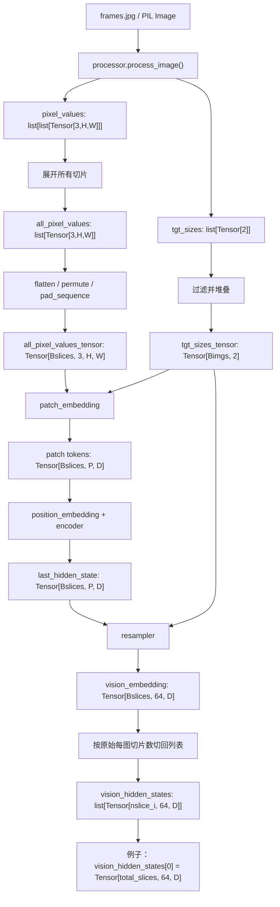

# Video stage

## Stage V0: VideoFrameSampler

```python
VideoChunkInput:
    video_path: str | None
    frame_base64_list: list[str] | None
    timestamp_ms: int
    fps: float = 1.0
```

```python
VideoFrameBatch:
    frames: list[PIL.Image.Image]
    timestamps_ms: list[int]
    source: "mp4" | "websocket" 
```


[_extract_mp4_chunks line:1080](../../../MiniCPMO45/modeling_minicpmo_unified.py)


这里的核心逻辑是进行抽帧，输入是视频源（时序上的高帧数视频流或websocket中实时传入的图像帧），输出是单帧的Image（像素矩阵），用list[PIL.Image.Image]表示。

## Stage V1: VisionPreprocess

```python
VisionPreprocessInput:
    frames: list[PIL.Image.Image]
    max_slice_nums: int | list[int]
    do_pad: bool = True
```

```python
VisionProcessorOutput:
    pixel_values: list[list[torch.Tensor]]
    image_sizes: list
    tgt_sizes: list[torch.Tensor]
```

[process_image line:1137](../../../MiniCPMO45/processing_minicpmo.py)

将输入的Image进行归一化处理
输入Image，输出转换格式后的tensor像素矩阵


## Stage V2: VisionEncode

```python
VisionEncodeInput:
    pixel_values
    tgt_sizes
    device
    dtype
```

```python
VisionEmbeddingOutput:
    embeddings: list[torch.Tensor]
    # per batch item
    # each tensor shape roughly:
    #   [num_slices, 64, hidden_size]
    slice_counts: list[int]
    hidden_size: int
    dtype: torch.dtype
    device: torch.device
```


```text
在流式 duplex 里，注释明确说明：

vision_hidden_states[0] shape: [total_slices, 64, D]

这里的 64 是每张 source image 或 slice 对应的视觉 token 数。
```

[vision_hidden_states line:4698](../../../MiniCPMO45/modeling_minicpmo_unified.py)


这个stage是核心的编码阶段，涉及model.vpm、model.resampler


## Stage V3: VisionTokenPlan / FeedPlan

[for frame_idx, frame in enumerate(frame_list): line:4707](../../../MiniCPMO45/modeling_minicpmo_unified.py)

这个阶段是将image embedding和其他token按顺序feed给decode（可以简单理解为将image embedding 与 text embedding 进行 marge，但是这个过程是同时进行feed的）


## Vision data stream


